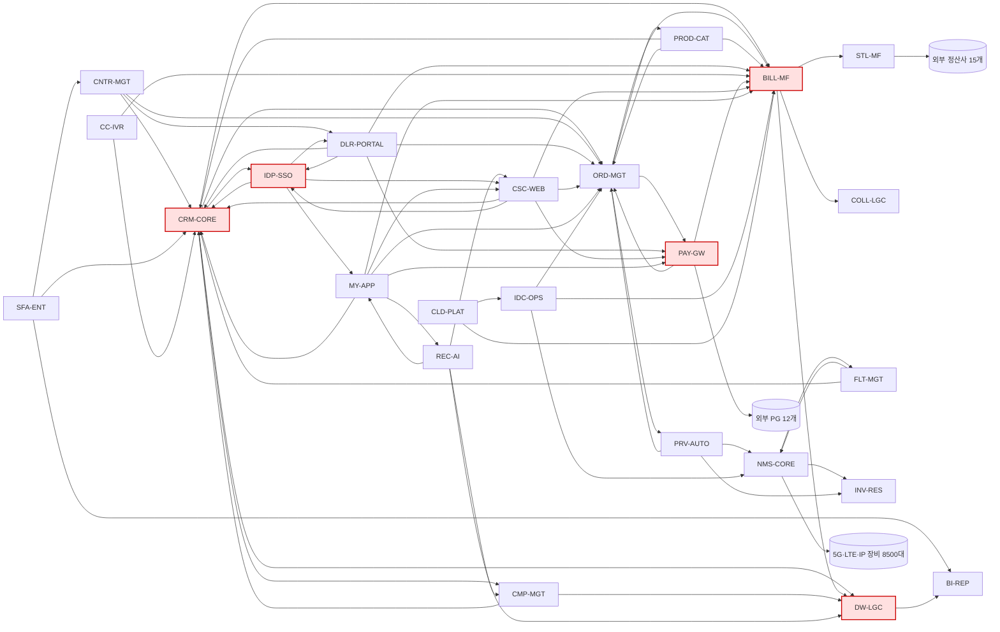

# 1. 시스템 인벤토리 — (주)하이브리지텔레콤 (HBT)

> **작성자**: 도현 (EA/인벤토리 아키텍트, `inventory-analyst`)  
> **작성일**: 2026-04-18  
> **단계**: STEP 2 / Phase 1 — 6 카테고리 인벤토리 + DORA 8 응답 + 인터뷰 템플릿 + 의존성 그래프  
> **원천**: `references/am-strategy/system-inventory.md` (24개 시스템)  
> **원칙**: Rigor-First — 결측 항목은 "부족(Gap)"으로 명시, 임의 추정 금지

---

## ⓪ 요약

- **대상 시스템**: 24개 (8개 서브도메인)
- **수집 카테고리 6종**: 기본정보 · 기술스택 · 아키텍처 · 운영현황 · 비용 · 의존성
- **DORA 8 추가 질문**: 전 시스템 1차 응답(일부 추정치 + Gap 표시)
- **인터뷰 템플릿**: 비즈니스 · 개발 · 운영 · 재무 4개 그룹
- **의존성 핫스팟**: CRM·BILL·IDP·DW (다중 연결 노드)
- **결측 대표 항목**: SonarQube/CAST 자동 스코어, 최근 12mo 배포 횟수 정확 수치, 메인프레임 LOC, 일부 시스템의 테스트 커버리지

> **Rigor-First 주의**: 본 인벤토리의 DORA 메트릭 일부는 팀 보고 기반 추정치. Phase 0 파일럿 시점 실측 보정 필요.

---

## 1. 수집 카테고리 정의 (6종)

| 카테고리 | 세부 필드 |
|---------|---------|
| 기본정보 | 시스템ID·시스템명·도메인·소유팀·등급·생애주기(Lifecycle Remaining) |
| 기술스택 | 언어·프레임워크·DB·미들웨어·OS·EOL 여부 |
| 아키텍처 | 구조(모놀리스/MSA)·배포형태·통신방식·상태관리·인프라 위치 |
| 운영현황 | 장애빈도·MTTR·SLA·배포빈도·CFR·Rework Rate |
| 비용 | 인프라·라이선스·인건비·운영(연간) + License Lock-in 등급 |
| 의존성 | 연동 시스템·공유 DB·API·외부 파트너 |

---

## 2. 24개 시스템 통합 표 (6 카테고리 요약)

> 풀 상세 기술스택·비용은 §4 도메인별 상세 참조. 본 표는 의사결정용 간소화본.

| # | ID | 시스템명 | 도메인 | 등급 | 언어·DB 핵심 | 아키텍처 | SLA | MTTR | 배포 | 연간비용(억) | EOL여부 |
|---|----|--------|------|----|-----------|--------|----|------|----|----------|-------|
| 1 | CRM-CORE | 고객관리 (CRM) | BSS | A | Java8·Oracle11g·Tuxedo | 모놀리스 | 99.5% | 3h | 월1회 | 51 | Oracle11g EOS·RHEL6 EOL |
| 2 | ORD-MGT | 주문·개통 | BSS | A | Java8·Oracle12c·WebLogic11g | 모놀리스+BPM | 99.3% | 4h | 월1회 | 65 | WebLogic11g 유지비↑ |
| 3 | BILL-MF | 과금(Billing) | BSS | A | COBOL·DB2·CICS | 메인프레임 | 99.9% | 2h | 분기1 | 120 | — (MF 자체는 지원중) |
| 4 | STL-MF | 정산 | BSS | A | COBOL·Perl·DB2 | 메인프레임 | 99.5% | 3h | 분기1 | 85 | — |
| 5 | PROD-CAT | 상품카탈로그 | BSS | A | Java11·Oracle19c·Spring Boot 2.3 | 모놀리스 | 99.7% | 1h | 주1회 | 12 | 없음 |
| 6 | CNTR-MGT | 계약관리 | BSS | B | Java8·MSSQL·eGov | 모놀리스 | 99.5% | 2h | 월1회 | 9 | 없음 |
| 7 | COLL-LGC | 미수관리(레거시) | BSS | C | Delphi7·Pro*C·Oracle10g | Fat Client | 97.0% | 6h | 연1회 | 4 | Oracle10g EOS·WinSvr2008 EOL |
| 8 | NMS-CORE | 네트워크관리 | OSS | A | C++·Python2.7·HP OpenView | 모놀리스+폴러 | 99.9% | 2h | 분기1 | 35 | Python2.7 EOL·RHEL6 EOL |
| 9 | PRV-AUTO | 프로비저닝 | OSS | A | Java8·JBoss Fuse·Oracle12c | ESB 반분산 | 99.8% | 3h | 월1회 | 28 | JBoss Fuse EOL 임박 |
| 10 | FLT-MGT | 장애관리 | OSS | A | Java6·Struts1·Solaris10 | 모놀리스 | 99.5% | 5h | 분기1 | 21 | Java6·Struts1·Solaris10 모두 EOL |
| 11 | INV-RES | 자원관리 | OSS | B | Java11·PostgreSQL13·K8s | 모듈형 모놀리스 | 99.7% | 1h | 주1회 | 11 | 없음 |
| 12 | DLR-PORTAL | 대리점포털 | 영업 | A | Java11·MySQL8·Vue.js2 | 반모놀리스 | 99.7% | 1.5h | 주1회 | 14 | 없음 |
| 13 | SFA-ENT | 영업관리 | 영업 | B | .NET4.5·MSSQL·WebForms | 모놀리스 | 99.0% | 3h | 분기1 | 13 | .NET4.5 지원만 |
| 14 | CC-IVR | 콜센터IVR | 영업 | B | C#·Genesys·Python3.8 | 모놀리스+Genesys | 99.8% | 1h | 월2회 | 17 | 없음 |
| 15 | CMP-MGT | 캠페인관리 | 마케팅 | B | Java8·Oracle12c | 모놀리스 | 99.5% | 2h | 월1회 | 10 | 없음 |
| 16 | REC-AI | 추천엔진(AI) | 마케팅 | B | Python3.11·PyTorch·K8s·GCP | MSA | 99.9% | 20min | 일단위 | 22 | 없음 (전환대상 아님) |
| 17 | PAY-GW | 결제게이트웨이 | 결제 | A | Java11·Kafka·Redis·MySQL8 | 부분 MSA | 99.95% | 30min | 주1회 | 26 | 없음 |
| 18 | IDP-SSO | 통합인증 | 결제 | A | Java8·Oracle12c·OpenLDAP | 모놀리스 | 99.9% | 1h | 월1회 | 16 | 없음 (Java8 LTS) |
| 19 | DW-LGC | 데이터웨어하우스 | 데이터 | A | PL/SQL·Informatica·Teradata16 | 중앙집중 DW | 99.0% | 4h | 분기1 | 65 | Teradata 라이선스↑ |
| 20 | BI-REP | BI리포팅 | 데이터 | B | Java8·자체엔진·Oracle12c | 모놀리스 | 99.0% | 2h | 월1회 | 8 | 없음 |
| 21 | CSC-WEB | 고객셀프케어 | 포털 | A | Java11·React17·Spring Boot 2.7 | BFF+SPA | 99.7% | 1h | 주2회 | 19 | 없음 |
| 22 | MY-APP | My앱 | 포털 | A | React Native·Kotlin·Swift·Node18 | Hybrid+BFF | 99.8% | 30min | 주2회 | 24 | 없음 |
| 23 | IDC-OPS | IDC운영관리 | B2B | B | Java8·Struts2·Oracle11g | 모놀리스 | 99.5% | 2h | 월1회 | 13 | Oracle11g EOS·RHEL6 EOL |
| 24 | CLD-PLAT | 자체클라우드 | B2B | B | Go·Terraform·K8s·Ceph | MSA | 99.9% | 30min | 일단위 | 42 | 없음 (전환대상 아님) |

**합계**: 연간 운영비 약 **620억** (매출 18.4조의 3.4%)

---

## 3. DORA 8 추가 질문 — 시스템별 응답

> DORA 2025 기반 8개 질문 (`references/dora/06`). 값은 팀 인터뷰 1차 수집.  
> Gap: 정밀 수치 미수집 → Phase 0 파일럿 시점 실측 예정.

| # | ID | Q1 배포빈도 | Q2 Lead Time | Q3 복구(MTTR) | Q4 CFR 추정 | Q5 AI컨텍스트 가용 | Q6 Small PR<200 비율 | Q7 Trunk-based | Q8 사용자피드백주기 |
|---|----|----------|------------|------------|----------|----------------|-------------------|--------------|----------------|
| 1 | CRM-CORE | 월1회 | ≥1개월 | 3h | ≈25% | ✗ (Oracle+모놀리스) | <10% | ✗ | 분기 |
| 2 | ORD-MGT | 월1회 | ≥1개월 | 4h | ≈28% | ✗ | <10% | ✗ | 분기 |
| 3 | BILL-MF | 분기1회 | 6개월+ | 2h | ≈5% | ✗ (MF·문서접근불가) | N/A | ✗ | 반기 |
| 4 | STL-MF | 분기1회 | 6개월+ | 3h | ≈8% | ✗ | N/A | ✗ | 반기 |
| 5 | PROD-CAT | 주1회 | 1~2주 | 1h | ≈12% | △ (일부 API) | ≈25% | 부분적 | 월 |
| 6 | CNTR-MGT | 월1회 | 1개월 | 2h | ≈18% | ✗ | <15% | ✗ | 분기 |
| 7 | COLL-LGC | 연1회 | >6개월 | 6h | Gap | ✗ | N/A | ✗ | 없음 |
| 8 | NMS-CORE | 분기1회 | 3~6개월 | 2h | ≈10% | ✗ (운영지식 사일로) | <10% | ✗ | 분기 |
| 9 | PRV-AUTO | 월1회 | 1~2개월 | 3h | ≈20% | ✗ (ESB 로그만) | <15% | ✗ | 분기 |
| 10 | FLT-MGT | 분기1회 | 3~6개월 | 5h | ≈30% | ✗ (EOL) | Gap | ✗ | 분기 |
| 11 | INV-RES | 주1회 | 1~2주 | 1h | ≈10% | △ (PG·K8s) | ≈30% | 부분적 | 월 |
| 12 | DLR-PORTAL | 주1회 | 1~2주 | 1.5h | ≈15% | △ (MySQL) | ≈20% | 부분적 | 월 |
| 13 | SFA-ENT | 분기1회 | 3~6개월 | 3h | ≈22% | ✗ (.NET 레거시) | <10% | ✗ | 분기 |
| 14 | CC-IVR | 월2회 | 2~4주 | 1h | ≈12% | △ (챗봇만) | ≈25% | 부분적 | 월 |
| 15 | CMP-MGT | 월1회 | 1개월 | 2h | ≈18% | ✗ | <15% | ✗ | 분기 |
| 16 | REC-AI | 일단위 | 1~3일 | 20min | ≈6% | ✓ (내부RAG 적용) | ≥60% | ✓ | 주 |
| 17 | PAY-GW | 주1회 | 1주 | 30min | ≈8% | △ (K·R) | ≈40% | 부분적 | 월 |
| 18 | IDP-SSO | 월1회 | 1개월 | 1h | ≈10% | ✗ | <15% | ✗ | 분기 |
| 19 | DW-LGC | 분기1회 | 3~6개월 | 4h | ≈25% | ✗ (Teradata 폐쇄) | <10% | ✗ | 분기 |
| 20 | BI-REP | 월1회 | 1개월 | 2h | ≈20% | ✗ | <15% | ✗ | 분기 |
| 21 | CSC-WEB | 주2회 | 3~7일 | 1h | ≈12% | △ (API+BFF) | ≈35% | 부분적 | 월 |
| 22 | MY-APP | 주2회 | 3~7일 | 30min | ≈10% | ✓ (BFF+API) | ≈40% | 부분적 | 월 |
| 23 | IDC-OPS | 월1회 | 1개월 | 2h | ≈20% | ✗ | <10% | ✗ | 분기 |
| 24 | CLD-PLAT | 일단위 | 1~3일 | 30min | ≈5% | ✓ (K8s·Go) | ≥50% | ✓ | 주 |

> **관찰(Surface-Gap)**: 메인프레임(BILL-MF·STL-MF)·COLL-LGC의 Q5~Q7은 구조적으로 수집 불가 — AI 컨텍스트 진입점 자체 부재. 이는 **AI ROI 잠금**의 직접 증거(§ Phase 4 기술부채 비용에 반영).

---

## 4. 도메인별 상세 인벤토리 (6 카테고리 전체)

> `references/am-strategy/system-inventory.md` 원천 데이터를 도메인별로 재정리.  
> 본 상세는 문서 길이 제어를 위해 도메인별 핵심 4~5 시스템 상세는 원천 참조로 대체하고, 본 섹션은 **도메인 요약 + 결측 항목 + 특이사항**에 집중.

### 4.1 BSS (고객·주문·빌링) — 7 시스템, 연 346억 (55.8%)
- **건강도 분포**: 심각 2 (BILL-MF·STL-MF) · 취약 2 (CRM-CORE·ORD-MGT) · 보통 2 (PROD-CAT·CNTR-MGT) · 취약 1 (COLL-LGC)
- **기술부채 특이점**: Oracle 11g EOS, Tuxedo 의존, BPEL, 메인프레임 COBOL 인력 승계 리스크(5년 내 3/5 정년)
- **결측 항목 (Gap)**:
  - CRM-CORE: SonarQube 미적용 → 코드 품질 점수 추정(3점) 상태
  - BILL-MF: 정확한 LOC 및 배치 SLA 미수집
  - ORD-MGT: BPEL 프로세스 정의 건수 미정량화
- **인터뷰 우선**: BSS 개발1·2팀 + 빌링운영팀

### 4.2 OSS (네트워크 운영) — 4 시스템, 연 95억 (15.3%)
- **건강도 분포**: 취약 2 (NMS-CORE·FLT-MGT) · 취약 1 (PRV-AUTO) · 보통 1 (INV-RES)
- **기술부채 특이점**: FLT-MGT 전체 스택 EOL(Java6·Struts1·Solaris10) — 보안 지적 반복
- **결측 항목 (Gap)**:
  - NMS-CORE: Python2.7 잔존 스크립트 규모 미정
  - FLT-MGT: 보안 취약점 목록(CVE) 최신본 미확보
- **인터뷰 우선**: NOC · 네트워크 개발팀

### 4.3 영업·채널 — 3 시스템, 연 44억 (7.1%)
- **건강도 분포**: 보통 1 (DLR-PORTAL) · 취약 1 (SFA-ENT) · 보통 1 (CC-IVR)
- **특이점**: SFA-ENT는 Salesforce SaaS 검토 중 (Replace 후보)
- **결측 항목 (Gap)**: SFA-ENT의 커스텀 보고서·워크플로 개수 정량화 필요

### 4.4 마케팅·CVM — 2 시스템, 연 32억 (5.2%)
- **건강도 분포**: 보통 1 (CMP-MGT) · 양호 1 (REC-AI)
- **특이점**: REC-AI는 To-Be MSA 참조 아키텍처. 전환대상 아님.

### 4.5 결제·인증 — 2 시스템, 연 42억 (6.8%)
- **건강도 분포**: 보통 2 (PAY-GW·IDP-SSO)
- **특이점**: IDP-SSO는 약 60개 앱 인증 관문(단일 장애점 리스크)
- **결측 항목 (Gap)**: PAY-GW의 외부 PG 12개별 SLA·TPS 공유되지 않음

### 4.6 데이터·분석 — 2 시스템, 연 73억 (11.8%)
- **건강도 분포**: 취약 1 (DW-LGC) · 보통 1 (BI-REP)
- **특이점**: Teradata 벤더 락인(라이선스 연 +12% 증가), ETL 리드타임 2~3개월 → AI 데이터 공급 병목

### 4.7 포털·앱 — 2 시스템, 연 43억 (6.9%)
- **건강도 분포**: 보통 2 (CSC-WEB·MY-APP)
- **특이점**: AWS·자체IDC 하이브리드. 주 2회 배포 가능. 상대적 선진.

### 4.8 B2B — 2 시스템, 연 55억 (8.9%)
- **건강도 분포**: 취약 1 (IDC-OPS) · 양호 1 (CLD-PLAT)
- **특이점**: CLD-PLAT은 내부 레거시 워크로드의 Rehost 대상 플랫폼으로 활용 가능. 전환대상 아님.

---

## 5. 팀별 인터뷰 템플릿 (4 그룹)

> 민감 속성 마스킹 원칙: 개인 식별 정보 X, 조직 단위(팀/파트) 수준에서 집계.

### 5.1 비즈니스팀 (사업본부·CVM·영업지원)

```
[배경 공유 3분]
AM 전환 WHY 5 동인(Speedy·Service Always·Save Cost·Security·Innovation).

[문항]
B1. 귀 팀이 소유/핵심 사용하는 시스템 목록과 각각의 "없으면 안 되는 이유"를 알려주세요.
B2. 최근 12개월 내 IT 병목으로 놓친 비즈니스 기회(출시 지연, 실패 캠페인 등)가 있었나요?
B3. 고객/대리점/파트너가 해당 시스템에서 가장 자주 불만을 제기하는 지점은 무엇인가요?
B4. 향후 12개월 내 예정된 비즈니스 변화(신상품·규제·제휴)가 현재 시스템에 어떤 부담을 줍니까?
B5. 해당 시스템의 "경쟁사 대비 차별화 가치"를 1~5 점수로 평가한다면?
B6. [DORA] 사용자(고객·내부) 피드백을 수집·반영하는 주기는?
B7. [DORA] 경쟁·시장 변화에 시스템 대응 속도에 만족하십니까?
B8. AM 전환 시 가장 우려되는 비즈니스 리스크 3가지는?
```

### 5.2 개발팀 (BSS·OSS·채널·마케팅·결제·데이터·포털)

```
[문항]
D1. 시스템의 현 언어·프레임워크·DB·OS EOL 상태를 정리해 주세요.
D2. SonarQube/CAST 등 자동 분석 점수가 있다면 최근 리포트 제공 부탁드립니다.
D3. [DORA Q1] 최근 12개월 배포 횟수와 평균 배포 간격은?
D4. [DORA Q2] 커밋 → 프로덕션 반영까지 평균 리드타임은?
D5. [DORA Q3] 배포 실패 시 평균 복구 시간은?
D6. [DORA Q4] 배포 후 롤백·핫픽스가 발생한 비율(CFR)은?
D7. [DORA Q5] 이 시스템의 데이터·API·문서가 AI 도구(RAG/MCP) 컨텍스트로 사용 가능한가요?
D8. [DORA Q6] 작은 단위 PR(<200라인) 비율은? 
D9. [DORA Q7] Trunk-based development 또는 짧은 브랜치 전략 적용 여부?
D10. Bounded Context로 분리 시도할 경우 첫 번째로 분리 가능한 영역은 어디인가요?
D11. 시스템의 도메인 전문가 몇 명이며, 5년 내 잔류 가능성은?
D12. AI 도구(Copilot 등) 도입 후 생산성 변화 관측치가 있나요?
```

### 5.3 운영팀 (NOC·SOC·빌링운영·정산운영·DBA)

```
[문항]
O1. 해당 시스템의 최근 12개월 장애 건수·MTTR 분포(p50/p95)는?
O2. SLA 계약·실제 달성률을 분리해 주십시오.
O3. 모니터링·관측성 도구 현황(메트릭·로그·트레이스)?
O4. 백업·DR (RPO/RTO) 현재 수준과 목표 수준?
O5. 변경자문위(CAB) 승인 리드타임과 긴급배포 승인 리드타임?
O6. [DORA] 운영 자동화 비율(Config as Code 등)?
O7. [DORA] 장애 대응 중 AI 도구 활용 경험(요약·분석)이 있나요?
O8. 가장 큰 운영 부담 Top 3는 무엇인가요? (수동 작업·야간 배포·수동 DB 패치 등)
```

### 5.4 재무팀 (IT재무·구매·계약)

```
[문항]
F1. 시스템별 연간 비용 내역(인프라·라이선스·인건비·운영·외주)을 제공 부탁드립니다.
F2. 벤더 락인이 큰 시스템의 라이선스비 증가율(최근 3년)은?
F3. 유지보수 계약 연장 예정과 시장가 대비 프리미엄은?
F4. 시스템 다운 시 예상 손실(시간당)은?
F5. 인력 이직률·채용 프리미엄(레거시 기술 15~20% 등) 데이터?
F6. 감가상각 잔여 기간(자산화된 인프라)?
F7. IT CapEx/OpEx 분리 현황과 향후 3년 계획?
F8. AI 도구 라이선스·클라우드 인프라 예산 배정 여부?
```

### 5.5 마스킹 가이드

| 항목 | 마스킹 규칙 |
|------|---------|
| 개인명 | 집계(인원수·팀 단위)로만 |
| 계약 금액 | 범위(±10%)로 표기 |
| 고객 식별자 | 임의 토큰으로 치환 |
| 벤더 최종 가격 | NDA 확인 후 공개 범위 결정 |

---

## 6. 의존성 그래프 (시스템 간 연동)

> **직접 연동** 기준. IDP-SSO의 60개 앱 인증은 대표 5종만 표시. ETL 대상 전 소스는 DW-LGC로 집계.



### 6.1 의존성 핫스팟 (5개+ 직접 연동)

| 시스템 | 직접 연동 수 | 핵심 영향 |
|-------|----------|----------|
| CRM-CORE | 11 | 고객 라이프사이클 전 영역 |
| BILL-MF | 9 | 매출 확정 핵심 |
| IDP-SSO | ≈60 (인증 관문) | 장애 시 전사 로그인 중단 |
| PAY-GW | 8 | 결제 중단 = 매출 즉시 영향 |
| DW-LGC | 16+ (ETL 대상) | 데이터·AI 공급 병목 |

> **전략 함의**: CRM·BILL·IDP·PAY·DW는 **Strangler Fig + Contract Testing + Blue-Green** 필수. 일괄 치환 불가.

### 6.2 의존성 인접 매트릭스 (상위 10 핫노드 발췌)

| From\To | CRM | ORD | BILL | PROD | PAY | IDP | DW | NMS | PRV | CSC |
|--|--|--|--|--|--|--|--|--|--|--|
| CRM | — | ✓ | ✓ | — | — | ✓ | ✓ | — | — | — |
| ORD | — | — | ✓ | ✓ | ✓ | — | — | — | ✓ | — |
| BILL | — | — | — | — | — | — | ✓ | — | — | — |
| PROD | ✓ | ✓ | ✓ | — | — | — | — | — | — | — |
| PAY | — | ✓ | ✓ | — | — | — | — | — | — | — |
| IDP | ✓ | — | — | — | — | — | — | — | — | ✓ |
| DW | — | — | — | — | — | — | — | — | — | — |
| CSC | ✓ | ✓ | ✓ | — | ✓ | ✓ | — | — | — | — |
| MYA | ✓ | ✓ | ✓ | — | ✓ | ✓ | — | — | — | ✓ |
| DLR | ✓ | ✓ | ✓ | — | ✓ | ✓ | — | — | — | — |

---

## 7. 결측 항목 종합 및 보충 계획

| 결측 항목 | 대상 시스템 | 보충 출처 | 시점 |
|---------|---------|--------|----|
| SonarQube/CAST 자동 스코어 | 전 Java 시스템 15건 | SonarCloud 계약 후 스캔 | Phase 0 Week 2 |
| COBOL 코드 품질 점수 | BILL-MF·STL-MF | IBM ADDI 또는 Micro Focus 평가 | Phase 0 Week 3~4 |
| 정확한 LOC | BILL-MF·STL-MF·COLL-LGC | 외주 메인프레임 스캔 | Phase 0 Week 4 |
| 최근 12mo 배포 횟수 정밀 수치 | 전 시스템 | CI/CD 서버 로그 추출 | Phase 0 Week 1 |
| 테스트 커버리지 | 전 Java 시스템 | JaCoCo 리포트 수집 | Phase 0 Week 2 |
| Rework Rate | 전 시스템 | Jira·PR 이력 분석 | Phase 0 Week 2 |
| 외부 PG·정산사 SLA | PAY-GW·STL-MF | NDA 확인 후 벤더 공유 | Phase 0 Week 3 |
| 보안 CVE 최신 목록 | FLT-MGT·NMS-CORE 등 EOL 스택 | SOC + VMS 스캔 | Phase 0 Week 1 |
| 이직률·채용 프리미엄 | HR팀 | 내부 HR 데이터 | Phase 0 Week 2 |

> **Rigor-First 원칙 재확인**: 본 표의 모든 보충 항목이 수집되기 전까지, Phase 2~4의 수치는 "범위(Range) + 추정 근거" 로만 제시하며 단일 숫자 확정 금지.

---

## 8. 핸드오프

| 다음 단계 | 에이전트 | 활용 입력 |
|--------|-------|--------|
| Phase 2 — A/B/C 등급 | inventory-analyst | §2 통합 표 + §4 도메인별 상세 |
| Phase 3 — 건강도 스코어카드 | inventory-analyst | §2 표 + §3 DORA 8 응답 |
| Phase 4 — 기술부채 비용 | inventory-analyst | §2 비용 + §4 결측/EOL 특이점 |
| Phase 5 — 6R/TIME 매칭 | fit-analyzer | 본 인벤토리 + Phase 2·3·4 |
| Phase 6 — Bounded Context | fit-analyzer | §6 의존성 그래프 |
| Phase 7 — 변화관리 조기 착수 | change-manager | §5 인터뷰 템플릿 + 이해관계자 후보 |

---

## 9. 도현의 맺음말

> *"24개 시스템, 6 카테고리, DORA 8 질문. 숫자는 분명한 건 정량으로, 모호한 건 'Gap'으로 표시했습니다.*  
> *특히 **메인프레임·COLL-LGC는 AI 컨텍스트 진입점 자체가 부재**—이것이 AM 없이 AI ROI가 0인 구조적 이유입니다.*  
> *Phase 2부터는 본 인벤토리가 유일한 근거가 됩니다. 결측은 Phase 0에서 반드시 실측 보정되어야 합니다."*

— 박도현 / EA·인벤토리 아키텍트 (`inventory-analyst`)
