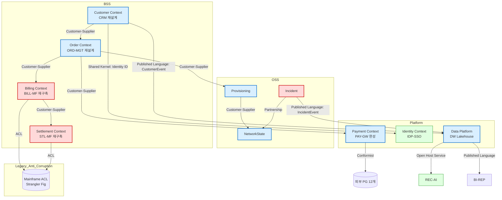

# 6. Bounded Context — HBT (Event Storming · Context Map · VSM)

> **작성자**: 민호 (`fit-analyzer`)  
> **작성일**: 2026-04-18  
> **단계**: STEP 2 / Phase 6 — Rearchitect/Rebuild 대상 9건에 대한 도메인 분해  
> **참조**: `references/dora/05-value-stream-management.md` · `references/6r/06-dora-integration.md`  
> **원칙**: Domain-First — 기술 스택보다 도메인 의미론 우선

---

## ⓪ 대상 시스템 (Phase 5 결과)

| # | ID | Primary 6R | 우선순위 |
|---|----|----------|-------|
| 1 | CRM-CORE | Rearchitect | ⭐ 1순위 (핫스팟) |
| 2 | ORD-MGT | Rearchitect | ⭐ 1순위 (핫스팟) |
| 3 | BILL-MF | Rebuild | ⭐ 3순위 (인력 승계 선행) |
| 4 | STL-MF | Rebuild | 4순위 (BILL 후속) |
| 5 | NMS-CORE | Rearchitect | 2순위 |
| 6 | PRV-AUTO | Rearchitect | 2순위 |
| 7 | FLT-MGT | Rebuild | ⭐ 1순위 (보안 시급) |
| 8 | PAY-GW | Rearchitect | 부분 완성형 |
| 9 | DW-LGC | Rearchitect | ⭐ AI 기반 |

> PROD-CAT/IDP-SSO/CSC-WEB/MY-APP 등 Replatform/Refactor 대상은 도메인 재정의 불요 — 본 Phase 대상 제외.

---

## 1. 도메인 이벤트 — 8개 핵심 컨텍스트

### 1.1 Customer Context (CRM 재설계)

```
[도메인 이벤트]
- 고객등록됨(CustomerRegistered)
- 고객정보변경됨(CustomerProfileUpdated)
- 요금제변경됨(PlanChanged)
- 해지요청됨(ChurnRequested)
- 해지확정됨(ChurnConfirmed)
- VIP등급조정됨(VIPTierChanged)
- 미수발생됨(OutstandingBalanceRecognized)  ← 이전 COLL-LGC 일부 흡수

[Aggregate]
Customer · Contract · Preference · ServiceProfile
```

### 1.2 Order Context (ORD-MGT 재설계)

```
[도메인 이벤트]
- 주문접수됨(OrderReceived)
- 주문검증완료됨(OrderValidated)
- 개통프로세스시작됨(ProvisioningStarted)
- 개통완료됨(ProvisioningCompleted)
- 주문취소됨(OrderCancelled)
- 주문실패됨(OrderFailed)
- 상품변경접수됨(PlanChangeRequested)

[Aggregate]
Order · Fulfillment · Provisioning · Activation
```

### 1.3 Billing Context (BILL-MF 재구축)

```
[도메인 이벤트]
- 사용량집계됨(UsageAggregated)
- 요금산정완료됨(ChargingCompleted)
- 청구서발행됨(InvoiceIssued)
- 납부확인됨(PaymentConfirmed)
- 과납/오납감지됨(PaymentAnomalyDetected)
- 연체처리됨(DelinquencyProcessed)

[Aggregate]
UsageRecord · Charge · Invoice · Payment
```

### 1.4 Settlement Context (STL-MF 재구축)

```
[도메인 이벤트]
- 도매정산시작됨(WholesaleSettlementInitiated)
- 국제정산시작됨(InternationalSettlementInitiated)
- 망간정산완료됨(InterconnectSettlementCompleted)
- 외부정산사합의됨(PartnerAgreementReached)
- 정산지연감지됨(SettlementDelayDetected)

[Aggregate]
SettlementBatch · PartnerAgreement · InterconnectCharge
```

### 1.5 Network Operations Context (NMS·PRV·FLT)

```
[도메인 이벤트]
- 네트워크상태변경됨(NetworkStateChanged)
- 서비스프로비저닝됨(ServiceProvisioned)
- 장애발생됨(IncidentDetected)
- 장애대응시작됨(IncidentTriageStarted)
- 장애복구됨(IncidentResolved)
- 자원할당됨(ResourceAllocated)
- 자원회수됨(ResourceReclaimed)

[Aggregate — 3개로 분리]
NetworkState · ServiceProvisioning · Incident
```

### 1.6 Payment Context (PAY-GW 완성)

```
[도메인 이벤트]
- 결제요청됨(PaymentRequested)
- 결제승인됨(PaymentAuthorized)
- 결제완료됨(PaymentCaptured)
- 결제취소됨(PaymentCancelled)
- 환불처리됨(RefundIssued)
- 부정거래감지됨(FraudDetected)

[Aggregate]
PaymentTransaction · Refund · PGChannel
```

### 1.7 Data Platform Context (DW-LGC Lakehouse)

```
[도메인 이벤트]
- 원본데이터수집됨(RawDataIngested)
- 정제데이터생성됨(CuratedDatasetProduced)
- AI학습데이터제공됨(TrainingDatasetPublished)
- 고객360뷰갱신됨(Customer360Refreshed)
- 데이터품질검증됨(DataQualityValidated)

[Aggregate]
DataAsset · DataPipeline · DataContract
```

### 1.8 Identity Context (IDP-SSO Replatform이지만 참조)

```
[도메인 이벤트]
- 로그인됨(UserAuthenticated)
- MFA성공됨(MFAVerified)
- 세션만료됨(SessionExpired)
- 권한조정됨(PermissionChanged)

[Aggregate]
Identity · Session · Credential
```

---

## 2. Context Map (Mermaid)



### 2.1 Context 간 관계 표

| From | To | 관계 유형 | 이유 |
|-----|----|------|-----|
| Customer | Order | Customer-Supplier | 주문은 고객 ID·요금제를 의존 |
| Customer | Identity | Shared Kernel | 고객 ID·인증 정보는 양 컨텍스트 공유 |
| Customer | DataPlat | Published Language | 고객 이벤트 발행 구독형 |
| Order | Billing | Customer-Supplier | 빌링은 주문 이벤트 수신 |
| Order | Provisioning | Customer-Supplier | 개통은 주문 수신 |
| Order | Payment | Customer-Supplier | 결제는 주문 수신 |
| Billing | Settlement | Customer-Supplier | 정산은 빌링 결과 수신 |
| Billing·Settlement | MF ACL | Anti-Corruption Layer | Strangler Fig로 MF와 단계적 분리 |
| Payment | 외부 PG | Conformist | PG 규격에 맞춤 |
| Provisioning | NetworkState | Customer-Supplier | 상태 변경 전달 |
| Incident | NetworkState | Partnership | 상호 이벤트 교환 |
| Incident | DataPlat | Published Language | 장애 이벤트 분석용 |
| DataPlat | REC-AI, BI-REP | Open Host Service | 공개 데이터 API |

---

## 3. 유비쿼터스 언어 사전 (핵심 용어)

### 3.1 Customer Context

| 용어 | 정의 | 기존 혼용어 |
|-----|----|----------|
| Customer | 통신 서비스 계약을 체결한 개인/법인 | "가입자", "고객", "계약자" 혼용 → Customer로 통일 |
| ServiceProfile | 고객의 현재 활성 서비스(요금제·부가·기기) | "상품보유", "가입상품" 혼용 |
| ChurnRequest | 해지 요청(확정 이전 단계) | "해지", "취소" 혼용 |
| OutstandingBalance | 미수 금액 | "미수", "연체" 혼용 |

### 3.2 Billing Context

| 용어 | 정의 | 기존 혼용어 |
|-----|----|----------|
| UsageRecord | CDR·데이터·SMS·부가 사용 단위 | "사용량", "CDR" |
| Charge | 단위 과금 결과 | "요금", "청구금액" |
| Invoice | 청구서 단위 (고객×주기) | "청구서", "납부서" |
| Payment | 고객의 납부 행위 | "수납", "납부" |

### 3.3 Order Context

| 용어 | 정의 | 기존 혼용어 |
|-----|----|----------|
| Order | 고객의 서비스 변경 요청 묶음 | "주문", "청약", "신청" |
| Provisioning | 주문 이후 네트워크·서비스 활성화 작업 | "개통" |
| Fulfillment | 주문 처리 전체 라이프사이클 | "처리", "이행" |

### 3.4 Network Ops Context

| 용어 | 정의 |
|-----|----|
| NetworkState | 네트워크 장비·링크·서비스의 논리 상태 |
| Incident | 장애 건 (탐지 → 복구) |
| Resource | 할당 가능한 논리·물리 자원 (IP·번호·회선) |

---

## 4. VSM As-Is / To-Be (code commit → production)

### 4.1 As-Is VSM (평균치, 24 시스템 가중평균)

| 단계 | Process Time | Wait Time | %C/A | 비고 |
|-----|-----------|---------|------|----|
| 1. 코드 작성 | 1~3일 | — | 95% | 팀별 편차 큼 |
| 2. 코드 리뷰 | 30분 | **3~7일** | 80% | ⚠️ 병목 1 |
| 3. 빌드 | 15~60분 | 1시간 | 90% | Jenkins 수동 트리거 |
| 4. QA 테스트 | 1~2일 | **3~5일** | 75% | ⚠️ 수동 회귀 |
| 5. 변경자문위(CAB) | 10분 | **1~2주** | 95% | ⚠️ 병목 2 |
| 6. UAT | 1일 | 2~5일 | 85% | |
| 7. 배포 승인 | 10분 | 1~3일 | 95% | |
| 8. 프로덕션 배포 | 1~3시간 | 1일 | 80% | ⚠️ 수동 |
| 9. 사후 검증 | 30분 | — | 90% | |

**Lead Time 합계**: **22주 (최대) / 4~8주 (최소)** — HBT 평균 Lead Time 22주와 일치

**주요 병목**:
1. 코드 리뷰 대기 (3~7일)
2. QA 수동 회귀 (3~5일)
3. CAB 대기 (1~2주)
4. 수동 배포 (1일)

### 4.2 To-Be VSM (3년 목표)

| 단계 | Process Time | Wait Time | %C/A | 개선 |
|-----|-----------|---------|------|----|
| 1. 코드 작성 | 1~3일 | — | 95% | AI 보조로 -30% |
| 2. 코드 리뷰 | 15~30분 | 1~4시간 | 95% | AI 리뷰 자동화 |
| 3. 빌드 | 5~15분 | — | 98% | Trunk-based + CI 자동 |
| 4. QA 테스트 | 자동 20~60분 | — | 95% | 자동화 커버리지 ≥80% |
| 5. CAB | 10분 | 2~4시간 | 98% | 표준 변경 자동 승인 |
| 6. UAT | 자동 2시간 | 1일 | 90% | BFF 기반 |
| 7. 배포 승인 | 자동 | — | 98% | Deployment Pipeline |
| 8. 프로덕션 배포 | 5분(Blue-Green) | — | 99% | 자동 + Canary |
| 9. 사후 검증 | 자동 모니터링 | — | 95% | SRE 대시보드 |

**Lead Time 합계**: **1~7일** — DORA 상위 24.4% 목표

### 4.3 6R × VSM 병목 매핑 (§refs/6r/06)

| 병목 | 원인 시스템 | 해결 6R |
|-----|---------|-------|
| 코드 리뷰 적체 | CRM·ORD·BILL·NMS 모놀리스 | Rearchitect (서비스 분리) |
| QA 수동 | 모놀리스 전체 | Rearchitect + Contract Testing |
| CAB 대기 | 거버넌스 프로세스 | STEP 3-5 거버넌스 (자동 승인 룰) |
| 수동 배포 | CI/CD 미구축 | Replatform (IDP 골든 패스) |
| 데이터 마이그레이션 | DW Teradata 락인 | DW Rearchitect |

---

## 5. Bounded Context별 Rearchitect/Rebuild 우선순위 (종합)

| 순위 | Context | 대상 시스템 | 6R | Phase | 근거 |
|---|-------|----------|----|----|----|
| 1 | Identity Context | IDP-SSO | Replatform | Phase 1 | 60+앱의 전제조건, 선행 |
| 2 | Customer Context | CRM-CORE | Rearchitect | Phase 2 | 11개 시스템 의존 핫스팟 |
| 2 | Order Context | ORD-MGT | Rearchitect | Phase 2 | 개통 = 매출 진입점 |
| 2 | Payment Context | PAY-GW | Rearchitect | Phase 1 | 부분 MSA → 완성 |
| 3 | Network Ops | NMS·PRV·FLT | Rearch/Rebuild | Phase 2 | FLT 보안 시급, NMS/PRV Phase 2~3 |
| 3 | Data Platform | DW-LGC | Rearchitect | Phase 2~3 | AI 공급 기반 |
| 4 | Billing Context | BILL-MF | Rebuild | Phase 3 | 인력 KT 선행 |
| 5 | Settlement Context | STL-MF | Rebuild | Phase 4 | BILL 완료 후 |

---

## 6. 9건의 Event Storming 워크숍 권장 어젠다

### 6.1 90분 Big Picture 워크숍 (9 컨텍스트별 1회)

```
[0~10분] 목적 공유 — DDD 기반 Bounded Context 식별
[10~30분] 도메인 이벤트 스티키 (과거형 동사)
[30~45분] 핫스팟 토론 (의문·충돌 지점)
[45~65분] 프로세스 흐름 정렬 (타임라인 순)
[65~80분] Bounded Context 후보 식별 (유사 이벤트 묶기)
[80~90분] 다음 워크숍 계획
```

### 6.2 Process Modeling (각 Context별 1회)

### 6.3 Software Design (통합 Context Map 확정 1회)

---

## 7. 핸드오프

| 다음 | 활용 | 에이전트 |
|-----|----|-------|
| STEP 3 전략 Phase 구성 | Context별 우선순위 §5 | strategy-planner |
| STEP 3 TCO | Rearch/Rebuild 기간·비용 | tco-analyst |
| Phase 7 변화관리 | Event Storming 워크숍 포함 | change-manager |

---

## 8. 민호의 맺음말

> *"9건 Rearchitect/Rebuild → 8개 Bounded Context. Domain-First 원칙으로 기술이 아닌 도메인으로 선을 그었습니다.*  
> *VSM 병목 4건 중 3건이 모놀리스 구조 기인 — Rearchitect가 병목 해소의 유일한 길입니다.*  
> *To-Be VSM Lead Time **22주 → 1~7일** — 이것이 DORA 상위 24% 목표의 구체적 장면입니다."*

— 정민호 / `fit-analyzer`
