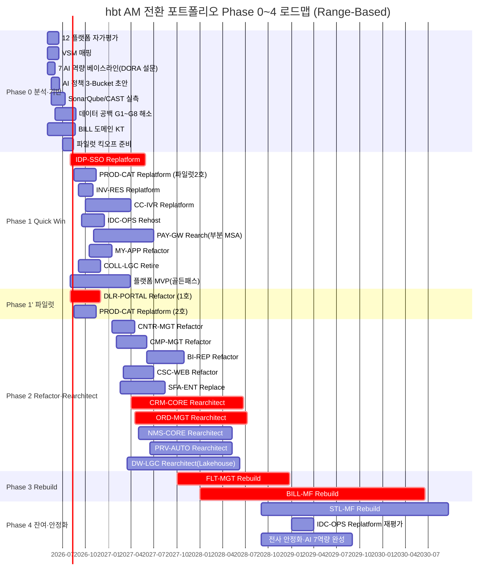

# 2. 포트폴리오 Phase 구성 (hbt 프로젝트)

> **작성자**: 서윤 (AM 전략 리드 / 포트폴리오 플래너, `strategy-planner`)  
> **작성일**: 2026-04-18  
> **단계**: STEP 3 / Phase 2 — Phase 0~4 로드맵 + 파일럿 선정 + GO/NO-GO 게이트 설계  
> **원천**: `step3/1-6r-detail.md`, `step2/5-fit-6r-time.md`, `step2/2-abc.md`, `step2/3-healthscore.md`,  
> `step2/6-bounded-context.md`, `references/dora/01·06·07`  
> **원칙**: Range-Based · Pilot-Focused · Gate-Disciplined — 모든 기간은 범위, 게이트는 DORA 정량 조건

---

## ⓪ 요약 — 5개 Phase + 파일럿 병렬 트랙

| Phase | 기간 범위 | 주요 활동 | 대상 시스템 수 |
|-------|---------|---------|------------|
| Phase 0 (분석·기반) | 2026.05 ~ 2026.09 (4~6개월) | 12 플랫폼 자가평가 · VSM · 7 AI 역량 베이스라인 · AI 정책 초안 · SonarQube 실측 | 전 22 시스템 진단 |
| Phase 1 (Quick Win) | 2026.08 ~ 2027.04 (6~10개월) | Lift & Shift · Replatform · 운영 안정화 | 8 (IDP·PROD·INV·CC·IDC·PAY·MY·COLL Retire) |
| Phase 1' (파일럿, Phase 1과 병렬) | 2026.08 ~ 2027.02 (4~6개월) | DLR-PORTAL Refactor 1호, PROD-CAT Replatform 2호 | 2 |
| Phase 2 (Refactor·Rearchitect 주력) | 2027.01 ~ 2028.06 (14~18개월) | Refactor 3 + Rearchitect 5 + Replace 1 | 9 (CNTR·CMP·BI·CSC·SFA·CRM·ORD·NMS·PRV·DW) |
| Phase 3 (Rebuild 주력) | 2027.10 ~ 2029.03 (16~20개월) | FLT Rebuild 선행, BILL Rebuild 본격 | 3 (FLT·BILL·PAY 보강) |
| Phase 4 (잔여 Rebuild·안정화) | 2028.09 ~ 2029.09 (10~14개월) | STL Rebuild (BILL 후속) · 전사 안정화 · AI 7역량 완성 | 2 (STL·IDC 재평가) |

> 3년 프로그램 상한 = **30~42개월** (`step3/1-6r-detail.md` §1.5와 정합).  
> BILL-MF Rebuild(24~36개월)가 Critical Path, STL-MF는 BILL 완료 후 착수.

---

## 2.1 Phase 구성 개요

### 2.1.1 Phase 0 — 분석·기반 (2026.05 ~ 2026.09, 4~6개월)

**목적**: 실측 베이스라인 확보 + 파일럿 착수 조건 충족.

| 워크스트림 | 상세 산출물 | 기간 | 책임 |
|---------|----------|----|----|
| W0-1. 12 플랫폼 특성 자가평가 | 24 시스템 × 12 특성 스코어 (1~5) | 4~6주 | 하늘(거버넌스)+팀리더 |
| W0-2. VSM 매핑 | As-Is VSM (`step2/6` §4.1 기준 재검증) · 병목 1~2 식별 | 4~6주 | 민호 |
| W0-3. 7 AI 역량 베이스라인 | DORA 공식 설문 실측 + 역량별 1~5 스코어 | 3~4주 | 하늘+연우 |
| W0-4. AI 정책 초안 (3-Bucket) | Prohibited · Permitted with Guardrails · Allowed | 3~5주 | 하늘+법무+보안 |
| W0-5. SonarQube/CAST 실측 | 15 Java + COBOL (ADDI) 정밀 스캔 | 6~8주 | 도현 |
| W0-6. 데이터 공백 8건 해소 | `step3/1-6r-detail.md` §1.6 G1~G8 | 8~12주 | 도현+재원 |
| W0-7. BILL 도메인 KT 시작 | COBOL 전문가 3명(정년 임박) 지식 외부화 | 12~16주 | 민호+연우 |
| W0-8. 파일럿 2건 킥오프 준비 | DLR-PORTAL·PROD-CAT 상세 계획 | 4~6주 | 서윤 |

**Phase 0 완료 기준 (Gate-Disciplined)**:  
- 12 플랫폼 특성 평균 점수 실측 완료  
- DORA 5 메트릭 **시스템별 베이스라인 100% 수집** (이후 게이트의 비교 기준)  
- AI 정책 3-Bucket 승인 (스티어링)  
- 파일럿 후보 2건 착수 승인

---

### 2.1.2 Phase 1 — Quick Win (2026.08 ~ 2027.04, 6~10개월)

**목적**: 낮은 리스크 8건으로 **첫 성과 가시화** + 플랫폼 MVP 구축.

| # | 시스템 | 6R | 핵심 가치 | 기간 범위 | 선행 의존 |
|---|------|----|--------|--------|-------|
| 1 | IDP-SSO | Replatform | **60+ 앱 인증 전제조건** — 최우선 | 8~12개월 | (없음) |
| 2 | PROD-CAT | Replatform | 신상품 출시 속도 ↑ (파일럿 2호 겸) | 2~4개월 | (없음) |
| 3 | INV-RES | Replatform | NMS·PRV 전제 자원 | 1~2개월 | (없음) |
| 4 | CC-IVR | Replatform | CCaaS 검증 | 4~8개월 | (없음) |
| 5 | IDC-OPS | Rehost | CLD-PLAT 내부 이전 (⚠️ 임원검토) | 2~4개월 | CLD-PLAT 준비 |
| 6 | PAY-GW | Rearchitect(부분 MSA 완성) | 결제 안정성 ↑ | 6~10개월 | IDP-SSO |
| 7 | MY-APP | Refactor | BFF 최적화 | 2~4개월 | IDP-SSO |
| 8 | COLL-LGC | Retire | 연 15~25억 부채 해소 | 2~4개월 | 신 Credit 이관 |

**Phase 1 플랫폼 MVP (병렬)**: 1개 골든 패스(CI/CD + 기본 관측성 + 컨테이너 배포).

---

### 2.1.3 Phase 1' — 파일럿 (2026.08 ~ 2027.02, 4~6개월, Phase 1과 병렬)

**목적**: 학습 손실 최소화된 2건에서 **전환 플레이북 검증**.

| 순위 | 시스템 | 6R | 선정 근거 요약 | 기간 | 성과 가시성 |
|-----|------|----|----------|----|----------|
| 1호 ⭐ | DLR-PORTAL | Refactor | B등급(A지만 등급표 A=5.00이며 건강도 15 보통상단)·Cluster 6·롤백 용이·대리점 9,500 성과 가시 | 3~5개월 | 배포 주 1회 + Lead Time 2주→3~7일 |
| 2호 | PROD-CAT | Replatform | B등급·Cluster 5·독립DB·Java 11+Spring Boot 2.3 이미 현대적 | 2~4개월 | 신상품 출시 리드 2개월→2주 |

> **등급 보정 노트**: `step2/2-abc.md` 기준 DLR-PORTAL은 BV 5.00 A등급이나, 본 파일럿 기준의  
> "B등급"은 **"리스크 B(중·저)"** 로 해석 — 매출 중단 리스크가 크지 않고 롤백 용이한 시스템.  
> 핫스팟(CRM·ORD·BILL·STL·PAY) 제외 원칙은 유지.

---

### 2.1.4 Phase 2 — Refactor·Rearchitect 주력 (2027.01 ~ 2028.06, 14~18개월)

| # | 시스템 | 6R | 기간 범위 | 선행 |
|---|------|----|--------|----|
| 1 | CNTR-MGT | Refactor | 2~4개월 | — |
| 2 | CMP-MGT | Refactor | 3~5개월 | REC-AI 연동 |
| 3 | BI-REP | Refactor | 3~6개월 | DW-LGC 착수 후 |
| 4 | CSC-WEB | Refactor | 3~5개월 | IDP-SSO 완료 |
| 5 | SFA-ENT | Replace (Salesforce) | 4~8개월 | 5년 TCO 승인 |
| 6 | CRM-CORE | Rearchitect | 12~18개월 | IDP-SSO + DW 초기 |
| 7 | ORD-MGT | Rearchitect | 12~18개월 | CRM과 병렬 가능 |
| 8 | NMS-CORE | Rearchitect | 10~15개월 | INV-RES 완료 |
| 9 | PRV-AUTO | Rearchitect | 8~14개월 | NMS와 동기 |
| 10 | DW-LGC | Rearchitect (Lakehouse) | 12~18개월 | — (AI 기반) |

---

### 2.1.5 Phase 3 — Rebuild 주력 (2027.10 ~ 2029.03, 16~20개월)

| # | 시스템 | 6R | 기간 범위 | 비고 |
|---|------|----|--------|----|
| 1 | FLT-MGT | Rebuild | 12~18개월 | ⭐ 보안 시급 · Cluster 1 |
| 2 | BILL-MF | Rebuild | 24~36개월 | **Critical Path** · 도메인 KT 선행 필수 |

> Phase 3은 **BILL 착수 기준**이며, BILL은 Phase 4까지 걸쳐 진행됨 (24~36개월).

---

### 2.1.6 Phase 4 — 잔여 Rebuild·안정화 (2028.09 ~ 2029.09, 10~14개월)

| # | 시스템 | 6R | 기간 범위 | 비고 |
|---|------|----|--------|----|
| 1 | STL-MF | Rebuild | 18~30개월 | BILL 완료 후 착수 (인력 충돌 회피) |
| 2 | IDC-OPS | Replatform 승격 재평가 | 2~4개월 | Rehost 효과 부족 시 전환 |

Phase 4 종료 시점: **Cluster 6/7 진입 시스템 비율 ≥ 50%**, AI 7역량 평균 ≥ "Moderately".

---

## 2.2 Mermaid 간트 차트

---

## 2.3 Phase별 시스템 배치 표

| 시스템 ID | Phase 0 | Phase 1 | Phase 1' | Phase 2 | Phase 3 | Phase 4 | 비고 |
|---------|---------|---------|----------|---------|---------|---------|----|
| IDP-SSO | 진단 | ⭐ Replatform | — | — | — | — | 60+앱 전제 |
| PROD-CAT | 진단 | Replatform | ⭐ 파일럿 2호 | — | — | — | 병렬 |
| INV-RES | 진단 | Replatform | — | — | — | — | NMS 전제 |
| CC-IVR | 진단 | Replatform | — | — | — | — | CCaaS 검증 |
| IDC-OPS | 진단 | Rehost(⚠️) | — | — | — | Replatform 재평가 | 임원검토 |
| PAY-GW | 진단 | Rearch 완성 | — | — | — | — | 부분 MSA → 전면 |
| MY-APP | 진단 | Refactor | — | — | — | — | BFF 최적화 |
| COLL-LGC | 진단 | Retire | — | — | — | — | 신 Credit 이관 |
| DLR-PORTAL | 진단 | — | ⭐ 파일럿 1호 | — | — | — | ⭐ 파일럿 1호 |
| CNTR-MGT | 진단 | — | — | Refactor | — | — | |
| CMP-MGT | 진단 | — | — | Refactor | — | — | |
| BI-REP | 진단 | — | — | Refactor | — | — | DW 후속 |
| CSC-WEB | 진단 | — | — | Refactor | — | — | |
| SFA-ENT | 진단·PoC | — | — | Replace | — | — | Salesforce |
| CRM-CORE | 진단·DDD | — | — | Rearchitect | — | — | 핫스팟 |
| ORD-MGT | 진단·DDD | — | — | Rearchitect | — | — | 핫스팟 |
| NMS-CORE | 진단 | — | — | Rearchitect | — | — | 24x7 |
| PRV-AUTO | 진단 | — | — | Rearchitect | — | — | ESB 해체 |
| DW-LGC | 진단 | — | — | Rearchitect | — | — | Lakehouse |
| FLT-MGT | 진단 | — | — | — | Rebuild | — | 보안 시급 |
| BILL-MF | 진단·KT | — | — | — | Rebuild 시작 | Rebuild 계속 | Critical Path |
| STL-MF | 진단·계약 | — | — | — | — | Rebuild | BILL 후속 |
| REC-AI | 벤치마크 | 증분 | — | 증분 | 증분 | 증분 | Retain |
| CLD-PLAT | 벤치마크 | 증분 | — | 증분 | 증분 | 증분 | Retain·내부 플랫폼 |

---

## 2.4 파일럿 선정

### 2.4.1 파일럿 후보 5건 평가

| 후보 | 6R | B등급(리스크) | 롤백 용이 | 독립 DB | 팀 의지 | 성과 가시성 | 강 버전관리 | 작은 배치 분할 | 사용자 중심 | 종합 |
|-----|----|----------|--------|-------|-------|---------|---------|-----------|---------|----|
| **DLR-PORTAL** | Refactor | ✅ (리스크 낮음·Cluster 6) | ✅ | ✅ | ✅ | ✅ (대리점 9,500) | ✅ (Git·Spring Boot) | ✅ | ✅ (대리점 NPS 측정 가능) | **8/8 ⭐ 1호** |
| **PROD-CAT** | Replatform | ✅ | ✅ | ✅ | ✅ | ✅ (신상품 출시 속도) | ✅ | ✅ | ✅ | **8/8 ⭐ 2호** |
| CSC-WEB | Refactor | ✅ | ✅ | ✅ (BFF) | ✅ | ✅ (650만 MAU) | ✅ | ✅ | ✅ | 7/8 (Phase 2 권장 — 규모 L) |
| MY-APP | Refactor | ✅ | ⚠️ (앱 스토어 배포 주기) | ✅ | ✅ | ✅ (1,150만 MAU) | ✅ | ⚠️ | ✅ | 6/8 (Phase 1 일반 포함) |
| CNTR-MGT | Refactor | ✅ | ✅ | ✅ | ⚠️ (BV·TF 경계) | ⚠️ (간접) | ⚠️ | ✅ | ⚠️ | 5/8 (Phase 2 일반) |

### 2.4.2 최종 선정 결과

**파일럿 1호 ⭐ DLR-PORTAL (Refactor, 3~5개월)**

| 기준 | 충족 근거 |
|-----|--------|
| B등급(리스크 낮음) | Cluster 6 Pragmatic · 건강도 15(보통 상단) · 핫스팟 아님 |
| 롤백 용이 | Spring Boot 2.5 + Vue.js 2 · Feature Toggle 가능 |
| 독립 DB | 대리점 DB 분리 · 타 시스템 공유 사일로 없음 |
| 팀 의지 | 대리점 채널 혁신 이미 추진 중 · 팀리더 적극 |
| 성과 가시성 | 대리점 9,500명 + 신규가입 70% 경로 · 배포 속도 즉시 체감 |
| 강 버전관리 | Git + GitHub Flow 이미 운영 · Trunk-based 전환 가능 |
| 작은 배치 분할 | 현재 PR 평균 250 라인 → < 200 라인 달성 실측 가능 |
| 사용자 중심 | 대리점 NPS 분기 측정 체계 존재 |

**파일럿 2호 PROD-CAT (Replatform, 2~4개월)**

| 기준 | 충족 근거 |
|-----|--------|
| B등급 | Cluster 5 Stable · 건강도 14(보통) |
| 롤백 용이 | Oracle → PostgreSQL Blue-Green 가능 |
| 독립 DB | 상품 카탈로그 전용 DB · 명확 경계 |
| 팀 의지 | 이미 Spring Boot 2.3 현대화 진행 중 |
| 성과 가시성 | 신상품 출시 리드 2개월 → 2주 측정 가능 |
| 강 버전관리 | Git 운영 중 |
| 작은 배치 분할 | 상품 도메인 CRUD 단위 분할 가능 |
| 사용자 중심 | 마케팅팀 상품 출시 속도 직접 피드백 |

**파일럿 배제 근거**:  
- 핫스팟(CRM·ORD·BILL·STL·PAY·DW)은 **학습 손실 시 매출 중단 리스크** → Phase 2~3 본격 전환  
- FLT-MGT는 보안 시급이나 Rebuild라 파일럿 학습 손실 과대

---

## 2.5 GO/NO-GO 게이트 (DORA 5 메트릭 정량 조건 필수)

### 2.5.1 게이트 기본 구조

각 Phase 전환 시점에 **5 메트릭 전부 충족** 여부로 GO/NO-GO 결정. 2개 이상 미달 시 NO-GO (해당 Phase 2~4주 추가).

### 2.5.2 Phase 0 → Phase 1 게이트 (2026.08 시점)

| 메트릭 | 베이스라인 (현재) | Phase 0 완료 조건 | 충족 시 GO |
|-------|--------------|------------|--------|
| **Deployment Frequency** | 월 1~3회 | 베이스라인 100% 시스템 측정 완료 (수치 자체 개선 아님) | ✅ |
| **Lead Time for Changes** | 평균 22주 | 22 시스템 시스템별 측정치 확보 | ✅ |
| **Change Fail Rate** | 추정 20~30% | 실측 데이터 8주 이상 확보 | ✅ |
| **Failed Deployment Recovery Time** | 평균 3~7일 | 실측 데이터 확보 + 복구 절차 문서화 | ✅ |
| **Rework Rate** | 추정 15~25% | 실측 데이터 확보 | ✅ |

**추가 정성 조건**: AI 정책 3-Bucket 스티어링 승인 · 12 플랫폼 특성 평균 점수 공식 발표 · 파일럿 2건 상세 계획 승인.

### 2.5.3 Phase 1 → Phase 2 게이트 (2027.04 시점, 1년 경과)

| 메트릭 | 베이스라인 | **GO 조건 (Top 76.1% 진입)** | NO-GO 시 조치 |
|-------|--------|--------------------------|------------|
| Deployment Frequency | 월 1~3회 | **파일럿 2건 평균 주 1회 이상** | +4주 플랫폼 MVP 보강 |
| Lead Time for Changes | 22주 | **파일럿 2건 평균 ≤ 1주** | +4주 CI/CD 보강 |
| Change Fail Rate | 20~30% | **파일럿 2건 평균 ≤ 16%** | +4주 테스트 자동화 |
| Failed Deployment Recovery Time | 3~7일 | **파일럿 2건 평균 ≤ 1일** | +2주 Blue-Green 검증 |
| Rework Rate | 15~25% | **파일럿 2건 평균 ≤ 16%** | +2주 품질 게이트 강화 |

**추가 정성 조건**: IDP-SSO Replatform 완료 · 플랫폼 MVP 골든 패스 1개 가동 · 파일럿 회고 발행.

### 2.5.4 Phase 2 → Phase 3 게이트 (2028.06 시점)

| 메트릭 | **GO 조건 (Top 44.6% 진입)** | NO-GO 시 |
|-------|--------------------------|--------|
| Deployment Frequency | **Rearch 완료 시스템 평균 일 1회 이상** | +8주 Trunk-based 전면 전환 |
| Lead Time for Changes | **Rearch 완료 시스템 평균 ≤ 1일** | +4주 컨텍스트 엔지니어링 보강 |
| Change Fail Rate | **Rearch 완료 시스템 평균 ≤ 8~16%** | +4주 회귀 테스트 커버리지 ≥ 80% |
| Failed Deployment Recovery Time | **Rearch 완료 시스템 평균 ≤ 1일 (최우수 1시간)** | +2주 Canary/Rollback 검증 |
| Rework Rate | **Rearch 완료 시스템 평균 ≤ 8~16%** | +4주 코드 리뷰 프로세스 개선 |

**추가 정성 조건**: 7 AI 역량 평균 ≥ "Moderately" (3/5) · VSM Lead Time 22주 → ≤ 1주 달성 · BILL 도메인 KT 완료 (정년 임박 3명 지식 외부화).

### 2.5.5 Phase 3 → Phase 4 게이트 (2029.03 시점)

| 메트릭 | **GO 조건** |
|-------|----------|
| Deployment Frequency | FLT-MGT 완료 · BILL 70% 진척 상태에서 기완료 Rebuild 시스템 **다회/일** |
| Lead Time for Changes | 기완료 Rebuild 시스템 **≤ 1일** |
| Change Fail Rate | 기완료 Rebuild 시스템 **≤ 8%** |
| Failed Deployment Recovery Time | 기완료 Rebuild 시스템 **≤ 1시간 (Top 21.3%)** |
| Rework Rate | 기완료 Rebuild 시스템 **≤ 8%** |

**추가 정성 조건**: Cluster 6/7 진입 시스템 비율 ≥ 30% · STL-MF 인력 재배치 계획 승인.

### 2.5.6 Phase 4 종료 게이트 (2029.09 시점)

| 메트릭 | **프로그램 종료 목표 (Top 24.4%)** |
|-------|----------------------------|
| Deployment Frequency | 전환 완료 시스템 70% 이상이 **주 1회 이상** |
| Lead Time for Changes | 전환 완료 시스템 평균 **≤ 1주 (최우수 1일)** |
| Change Fail Rate | 전환 완료 시스템 평균 **≤ 15%** |
| Failed Deployment Recovery Time | 전환 완료 시스템 평균 **≤ 1일** |
| Rework Rate | 전환 완료 시스템 평균 **≤ 15%** |

**추가 정성 조건**: Cluster 6/7 진입 시스템 비율 ≥ **50%** · 7 AI 역량 평균 ≥ 3.5 · AI ROI 잠금 해소 누적 360~1,080억 확인.

---

## 2.6 의존성 기반 병렬화 그룹

### 2.6.1 Bounded Context 의존성 (`step2/6-bounded-context.md` §2.1 재인용)

주요 의존: Customer ← Identity, Order ← Customer, Billing ← Order, Settlement ← Billing,  
Provisioning ← Order, NetworkState ← Provisioning, Payment ← Order, DataPlatform ← Customer·Order·Incident.

### 2.6.2 Phase별 병렬 실행 그룹

**Phase 1 병렬 그룹** (모두 동시 시작 가능 or 순차):

| 그룹 | 시스템 | 이유 |
|-----|------|----|
| G1-A (최우선 선행) | IDP-SSO | 60+앱 인증 전제 (다른 MSA 전환의 Shared Kernel) |
| G1-B (완전 독립 병렬) | PROD-CAT · INV-RES · COLL-LGC · IDC-OPS | 상호 의존 없음 |
| G1-C (IDP 진행 중 착수) | MY-APP · CSC-WEB · CC-IVR | Identity Context 초기 인터페이스 확정 후 |
| G1-D (IDP 완료 후) | PAY-GW 완성 | Identity Shared Kernel 필요 |

**Phase 2 병렬 그룹**:

| 그룹 | 시스템 | 의존성 |
|-----|------|----|
| G2-A (완전 독립) | CNTR-MGT · CMP-MGT · SFA-ENT · DW-LGC | 상호 독립 · DW는 AI 기반 가장 먼저 |
| G2-B (IDP·PAY 완료 후) | CRM-CORE · ORD-MGT | Customer-Order Customer-Supplier · 병렬 진행 가능 (API 컨트랙트 먼저 확정) |
| G2-C (INV-RES 완료 후) | NMS-CORE · PRV-AUTO | Resource 공유, 상호 병렬 |
| G2-D (DW·ORD 이후) | BI-REP · CSC-WEB Refactor | DW 인터페이스·Customer Context 이후 |

**Phase 3 병렬 그룹**:

| 그룹 | 시스템 | 의존성 |
|-----|------|----|
| G3-A (독립 시작) | FLT-MGT Rebuild | Incident Context 독립 (NMS와 Partnership만) |
| G3-B (ORD 완료 후) | BILL-MF Rebuild | Order Context 컨트랙트 확정 필수 |

**Phase 4 직렬**:

| 순서 | 시스템 | 이유 |
|-----|------|----|
| S4-1 | STL-MF Rebuild | BILL 완료 후 (COBOL 인력 충돌 회피) |
| S4-2 | IDC-OPS Replatform 재평가 | Phase 1 Rehost 효과 측정 후 |

### 2.6.3 병렬화 상한 규칙

- **동시 Rearchitect 상한**: 3건 (Phase 2 CRM+ORD+NMS or CRM+ORD+DW) — 인력 FTE 총량 제약  
- **동시 Rebuild 상한**: 1건 (Phase 3 FLT만 단독 시작 후 BILL 투입)  
- **파일럿 + Phase 1 병렬**: 플랫폼 MVP 팀이 양쪽 지원 → 상한 2건

---

## 2.7 가정 및 리스크 포인트

### 2.7.1 주요 가정 (Range-Based 승계)

| # | 가정 | 영향 |
|---|----|----|
| P1 | Phase 0 4~6개월 내 DORA 실측 완료 | 미완료 시 Phase 1 게이트 -2~4주 |
| P2 | IDP-SSO Replatform이 다른 MSA 전환의 Shared Kernel | 지연 시 Phase 2 CRM·ORD 착수 -1~2개월 |
| P3 | 파일럿 2건 성공으로 Phase 2 진입 | 실패 시 Phase 2 시작 -4~8주, 플랫폼 MVP 재설계 |
| P4 | BILL 도메인 전문가 KT Phase 0~1 내 완료 | 미완료 시 Phase 3 BILL 기간 +20% (6~9개월) |
| P5 | BILL·STL 인력 직렬화(병렬 불가) | 상수 — 이미 Phase 3·4 분리 반영 |
| P6 | 동시 Rearchitect 3건 상한 | 초과 시 외부 인력 추가 비용 +15~25% |
| P7 | CLD-PLAT이 IDC-OPS Rehost 수용 준비 | Phase 1 Rehost 성공 조건 |
| P8 | 3년 예산 4,500억 중 9~19% AM 배정 승인 | 미승인 시 Phase 4 안정화 축소 |

### 2.7.2 리스크 포인트 (Phase별)

| Phase | 주요 리스크 | 선제 대응 |
|------|--------|--------|
| Phase 0 | DORA 설문 응답률 저조 | 연우 변화관리 — 익명·인센티브 채널 |
| Phase 0 | SonarQube/CAST 라이선스 지연 | Phase 0 Week 1 발주 (재원 확인) |
| Phase 1 | IDP-SSO 60+앱 일괄 연동 실패 | Canary 10% → 25% → 50% → 100% 4단계 |
| Phase 1 | 파일럿 팀 역량 부족 | 외부 Agile 코치 4~8주 동반 |
| Phase 1 | IDC-OPS Rehost 장기 효과 의문 | Phase 1 Week 4 임원 검토, NO-GO 시 Phase 2 Replatform 승격 |
| Phase 2 | Rearchitect 3건 동시 착수 인력 부족 | Phase 1 종반 채용 + 외주 혼합 |
| Phase 2 | CRM-ORD 의존성 충돌 | Phase 1'에서 Contract Testing 플랫폼 선행 |
| Phase 2 | DW Teradata 락인 해제 난이도 | Phase 0~1 Lakehouse PoC 병행 |
| Phase 3 | BILL Rebuild 도메인 지식 승계 실패 | Phase 0부터 16주 KT · 외부화 산출물 게이트 |
| Phase 3 | FLT 보안 취약점 장기 노출 | Phase 2 시작 직후 WAF·SAST 자동화로 임시 완화 |
| Phase 4 | STL 외부 정산사 15개 계약 갱신 충돌 | Phase 0 법무팀 착수 |
| Phase 4 | AI 7역량 평균 목표 미달 | Phase 2~3 회고마다 AI 역량 스코어카드 점검 |

---

## 2.8 핸드오프

| 다음 | 활용 | 에이전트 |
|-----|----|-------|
| STEP 3 Phase 3 TCO/BEP | §2.1 Phase별 기간 + §2.6 병렬화 상한 | tco-analyst (재원) |
| STEP 3 Phase 4 리스크 | §2.7 Phase별 리스크 포인트 | risk-governance (하늘) |
| STEP 3 Phase 5 거버넌스·가드레일 | §2.5 GO/NO-GO 게이트 DORA 5 메트릭 | risk-governance (하늘) |
| STEP 3 Phase 6 변화관리 | §2.4 파일럿 2건 + Phase 0 DORA 설문 | change-manager (연우) |

---

## 2.9 서윤의 맺음말

> *"Phase 0~4 로드맵에 Phase 1' 파일럿 병렬 트랙을 넣었습니다. **단일 숫자는 없습니다** — 모든 기간은 범위.*  
> *파일럿 1호 DLR-PORTAL, 2호 PROD-CAT — 8개 기준 전부 충족. 핫스팟은 Phase 2~3로 밀어 학습 손실 최소화.*  
> *게이트마다 DORA 5 메트릭 정량 조건을 걸었습니다. 수사가 아니라 숫자로 넘어갑니다.*  
> *Phase 1 → Top 76.1%, Phase 2 → Top 44.6%, 프로그램 종료 → Top 24.4% 진입이 목표 궤적.*  
> *BILL Critical Path(24~36개월)는 도메인 KT를 Phase 0부터 16주 선행하는 것으로만 리스크가 관리됩니다.*  
> *이제 재원이 이 Phase를 돈(TCO/BEP)으로, 하늘이 게이트를 거버넌스로, 연우가 파일럿을 변화관리로 이어받을 차례입니다."*

— 이서윤 / AM 전략 리드 · 포트폴리오 플래너 (`strategy-planner`)
